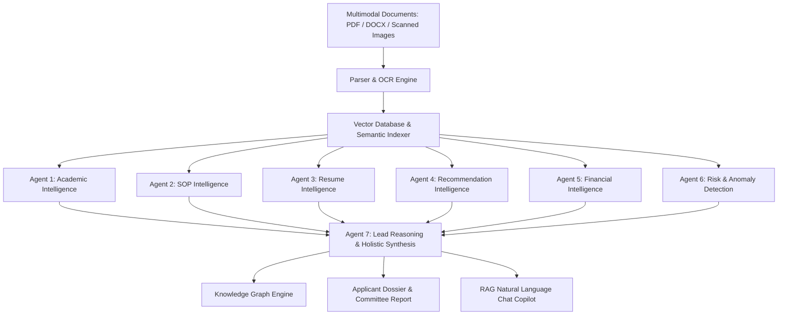

# 🎓 Admission Copilot

### Multi-Agent Explainable AI Admissions Intelligence Platform

> **An evidence-backed, human-in-the-loop AI copilot that assists university admissions committees in evaluating international student applications using 7 specialized cognitive agents, Multimodal Document OCR, Semantic Vector RAG Retrieval, and Interactive Knowledge Graphs.**

---

## 🛡️ Responsible AI Framework

> [!IMPORTANT]
> **Strict Non-Autonomous Decision Safeguards:**
> - The AI system **never makes final admission decisions autonomously**.
> - Every view, report, and copilot response features the mandatory disclaimer:
>   > *"This recommendation is generated by AI to assist admissions officers. Final admission decisions must always be made by authorized university staff."*
> - Admissions officers review traceable evidence citations and record official binding decisions with complete audit logs.

---

## 🧠 7-Agent Cognitive Architecture



1. **Agent 1: Academic Intelligence** — International GPA normalization (10-point, 100%, ECTs $\rightarrow$ 4.0), subject-level mastery breakdown, and semester grade trajectory analysis.
2. **Agent 2: SOP Intelligence** — Quantifies motivation depth, originality, writing quality, career goals, and specific faculty lab match.
3. **Agent 3: Resume Intelligence** — Technical skills taxonomy, verified projects, research publications (IEEE, ACM), and internships.
4. **Agent 4: Recommendation Intelligence** — Analyzes recommender credibility, tone, quantitative percentile benchmarks (*Top 1%*), and specific research anecdotes.
5. **Agent 5: Financial Intelligence** — Audits liquid assets (savings, loans, sponsorships), converts foreign currencies to USD, and computes 1-Year/2-Year Cost of Attendance funding gaps.
6. **Agent 6: Risk & Anomaly Detection** — Cross-audits claims across transcript, SOP, and resume to detect timeline gaps or discrepancies with non-punitive contextual explanations.
7. **Agent 7: Lead Reasoning & Holistic Synthesis** — Synthesizes outputs from Agents 1–6 into a unified explainable recommendation, confidence score, verified strengths, mitigating factors, and tailored interview questions.

---

## 🚀 Key Features

- **Multimodal Document Ingestion & OCR:** Ingests PDF (`pdfjs-dist`), Word DOCX (`mammoth`), and scanned image certificates (`tesseract.js`) with automatic category classification.
- **RAG Vector Search & Chat Copilot:** In-memory vector database with cosine similarity for grounded natural language question answering with exact source citations.
- **Interactive Knowledge Graphs:** SVG radial graph visualizer mapping Candidates to Skills, Projects, Subjects, Recommenders, and Financial Sponsors.
- **Side-by-Side Candidate Comparator:** 7-dimension Radar Chart benchmarking multiple applicants simultaneously with AI tradeoff synthesis.
- **Natural Language Semantic Search:** Discover applicants using conceptual criteria (e.g. *"Find students with research papers and high GPA"*).
- **Printable 14-Section Committee Dossier:** Exportable official committee dossier with print formatting and signature sign-off lines.
- **Applicant Self-Service Portal:** Student view with verification checklists, supplementary file upload, and admissions messaging.

---

## 💻 Tech Stack

- **Frontend:** React 19, TypeScript, Vite 8
- **Styling:** Tailwind CSS v4, Framer Motion
- **Document OCR & Parsing:** PDF.js, Mammoth, Tesseract.js
- **Charts & Graphs:** Recharts, SVG Force-Directed Radial Engine
- **Icons:** Lucide React

---

## 🛠️ Quick Start

```bash
# 1. Install dependencies
npm install

# 2. Start local development server
npm run dev

# 3. Build production bundle
npm run build

# 4. Run lint checks
npm run lint
```

Access the application in your browser at **http://localhost:5173/**.
